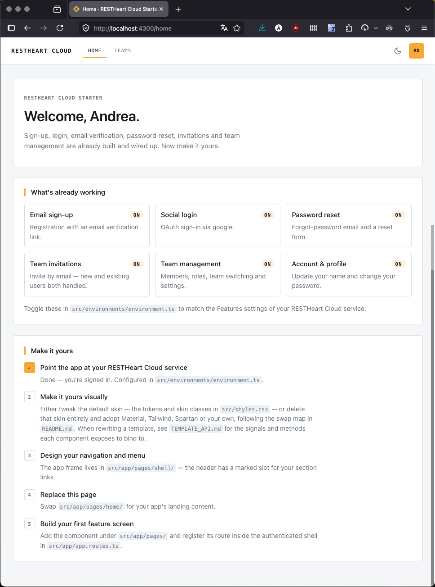

# RESTHeart Cloud Starter — Angular

An Angular starter built on [`@restheart-cloud/kit-ng`](https://github.com/SoftInstigate/restheart-cloud-kit/tree/main/packages/kit-ng). Implements all RESTHeart Cloud auth and multi-tenancy flows out of the box — fork it, point it at your RESTHeart Cloud service, and start building your app.

Works for multi-tenant SaaS (invitations, team switcher) and simpler apps (auth only).

## What's included

- Signup, login, logout — email/password and Google/GitHub OAuth
- Email verification, password reset
- Team invitations — one page (`/invitations/accept`) branching into a new-user "set password" form (calls `PATCH /auth/activate`) or an existing-user "log in and accept" form
- Team switcher — shown only when the user belongs to more than one team
- Authenticated shell with placeholder for your app content
- SSR for public routes, CSR for the authenticated shell



## Prerequisites

1. **A RESTHeart Cloud service** — [create one at cloud.restheart.com](https://cloud.restheart.com). Use a **free** service for development, a **shared** service (or higher) for production.
2. Angular CLI (`npm install -g @angular/cli`)

## Setup

### 1. Fork and clone

```bash
git clone https://github.com/your-org/restheart-cloud-starter-ng.git
cd restheart-cloud-starter-ng
npm install
```

### 2. Point to your RESTHeart Cloud service

After cloning, tell git to ignore local changes to the dev environment file:

```bash
git update-index --assume-unchanged src/environments/environment.dev.ts
```

Then edit `src/environments/environment.dev.ts` and set `apiUrl` to your free RESTHeart Cloud service URL. Your changes will not show up in `git status`.


### 3. Start

```bash
ng serve
```

## OpenWiki documentation

For recurring project documentation, start from the OpenWiki entry point and follow links from there:

- [openwiki/quickstart.md](openwiki/quickstart.md) — first stop, with navigation to all major topics
- [openwiki/index.md](openwiki/index.md) — generated index of OpenWiki content

Main OpenWiki topic pages:

- [openwiki/architecture.md](openwiki/architecture.md)
- [openwiki/domain-concepts.md](openwiki/domain-concepts.md)
- [openwiki/workflows.md](openwiki/workflows.md)
- [openwiki/operations.md](openwiki/operations.md)
- [openwiki/integrations.md](openwiki/integrations.md)
- [openwiki/testing.md](openwiki/testing.md)
- [openwiki/source-map.md](openwiki/source-map.md)

## Structure

```
src/
  styles.css              ← design tokens + the DISPOSABLE default skin
  environments/
    environment.ts        ← production apiUrl + feature flags
    environment.dev.ts    ← the file `ng serve` actually uses
  app/
    app.routes.ts         ← route map, titles, feature-flag gating
    app.config.ts         ← provideRhAuth() configured here
    theme.service.ts      ← light/dark toggle, persisted
    ui/alert/             ← the one shared feedback component
    pages/
      shell/              ← authenticated frame: header, nav, user menu
      home/               ← PLACEHOLDER showcase — replace with your content
      auth/               ← login, signup, verify, forgot/reset password
      invitations/accept/ ← one page, three flows (see below)
      teams/              ← list, detail (members/invites/settings), new
      account/            ← profile + change password
```

### Route map

| Path | Guard | Shown when |
|---|---|---|
| `/auth/login` | public only | always |
| `/auth/signup` | public only | `emailRegistration \|\| oauthLogin` |
| `/auth/verify` | public only | `emailRegistration` |
| `/auth/forgot-password`, `/auth/reset-password` | public only | `passwordReset` |
| `/invitations/accept` | **none** — works signed-in or out | `teamInvitations` |
| `/home`, `/teams`, `/teams/new`, `/teams/:id`, `/account` | authenticated | always |

Feature flags live in `src/environments/environment*.ts` and must match your service's
**Sign-up Mgmt → Features** toggles. A flag that's off removes the route *and* the UI that
links to it.

## Customization

### The default skin is meant to be thrown away

`src/styles.css` holds two things: **design tokens** (section 1) and a **disposable
default skin** (sections 3–5). The look is deliberately a *mockup* — cohesive and
intentional, but obviously a scaffold. `@restheart-cloud/kit-ng` ships no UI at all, so
the templates and this one stylesheet are the only places styling lives.

Two ways forward. Pick one:

**A. Tweak the skin** — fastest, roughly an hour to something that looks like yours:

1. Change the tokens in `styles.css` section 1 — colours, type scale, spacing, radii. Every
   component reads them, so this re-themes the whole app including dark mode.
2. Adjust the skin classes in section 3 if you want different shapes.
3. Replace the shell layout in `pages/shell/`.
4. Replace `pages/home/` with your own landing content.

**B. Adopt a UI framework** — Material, Spartan, PrimeNG, Tailwind, your own:

1. Delete sections 3–5 of `styles.css` (they are marked). Keep section 1 if you want the
   tokens; drop it too if your framework brings its own.
2. Reskin the templates using the swap map below.
3. See `TEMPLATE_API.md` for what each template binds to, so you can rewrite the markup
   without reading the component classes.

### Swap map

Templates reference a small, stable vocabulary of semantic class hooks. Restyle them, or
replace each element with your framework's component:

| Class hook | Used for | Tailwind (example) | Material (example) |
|---|---|---|---|
| `.card` / `.card-header` | Section container + its title row | `rounded border p-6 mb-6` | `<mat-card>` |
| `.btn-primary` | The one accented action per form | `px-6 py-2 rounded bg-amber-400 font-semibold` | `<button mat-flat-button color="primary">` |
| `.btn-secondary` | Quiet bordered action | `px-3 py-2 rounded border text-xs uppercase` | `<button mat-stroked-button>` |
| `.btn-danger` / `.btn-danger-text` | Destructive action / inline variant | `… text-red-700 border-red-700` | `<button mat-stroked-button color="warn">` |
| `.form-field` / `.form-field-sm` / `.form-row` | Label+control stack; `-sm` is narrow; `-row` lays fields side by side | `flex flex-col gap-1` / `flex gap-3` | `<mat-form-field>` |
| `.password-field` / `.btn-toggle-password` | Password input with a Show/Hide toggle | `relative` / `absolute right-2` | `<mat-form-field>` + suffix `<button mat-icon-button>` |
| `.form-error` / `.field-error` | Form-level / per-field error | `rounded border border-red-300 bg-red-50 p-3` | `<mat-error>` |
| `.success-msg` | Success feedback | `rounded border border-emerald-300 bg-emerald-50 p-3` | — (usually a snackbar) |
| `.muted` | Secondary/caption text | `text-sm text-gray-500` | `class="mat-caption"` |
| `.badge` | Small status pill | `rounded-full px-2 text-xs uppercase` | `<mat-chip>` |
| `.back-link` / `.eyebrow` | Back navigation / label above a title | `text-xs uppercase tracking-wide` | — |
| `.placeholder` / `.skeleton` | Empty-slot outline / loading block | `border border-dashed p-6` / `animate-pulse bg-gray-200` | `<mat-progress-bar mode="query">` |
| `.auth-page` / `.auth-card` / `.auth-links` / `.divider` | Centred auth layout | `min-h-screen grid place-items-center` / `w-90 rounded border p-8` | `<mat-card>` |
| `.config-page` / `.config-card` / `.config-status` / `.config-steps` | "Connect your service" screen | — | — |

Feedback is rendered through one component — `src/app/ui/alert/alert.ts` — which carries no
styles of its own, only the `.success-msg` / `.form-error` hooks plus the correct ARIA
roles. Swap that one component and every success/error message in the app follows.

Page-specific layout (`.team-row`, `.member-row`, `.feature-grid`, …) stays in the
component's own `.css` file and is not part of this contract.

### Documentation map

| File | Purpose |
|---|---|
| `README.md` | Setup, structure, and the swap map above. |
| `TEMPLATE_API.md` | What each template binds to: signals, methods, inputs, form controls. |
| `PORTING.md` | Framework-neutral behaviour spec — for building React/Vue versions at parity. |
| `openwiki/quickstart.md` | OpenWiki entry point and navigation hub for recurring docs. |
| `openwiki/architecture.md` | Architecture overview and key design choices. |
| `openwiki/domain-concepts.md` | Domain model and conceptual vocabulary. |
| `openwiki/workflows.md` | Development and contribution workflows. |
| `openwiki/operations.md` | Operational guidance and runbook-style notes. |
| `openwiki/integrations.md` | External services and integration points. |
| `openwiki/testing.md` | Testing strategy and practical testing guidance. |
| `openwiki/source-map.md` | Source navigation map for key modules and files. |

## Packages used

- [`@restheart-cloud/kit`](https://github.com/SoftInstigate/restheart-cloud-kit/tree/main/packages/kit) — TypeScript auth logic
- [`@restheart-cloud/kit-ng`](https://github.com/SoftInstigate/restheart-cloud-kit/tree/main/packages/kit-ng) — Angular adapter
