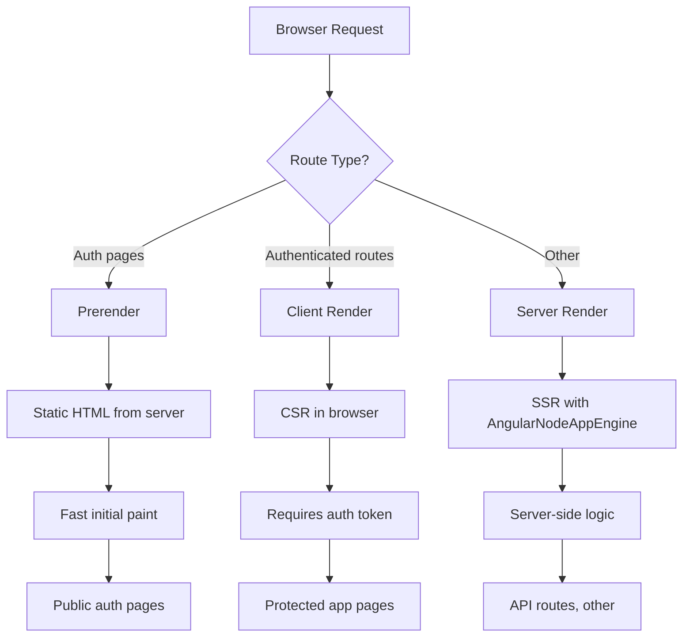
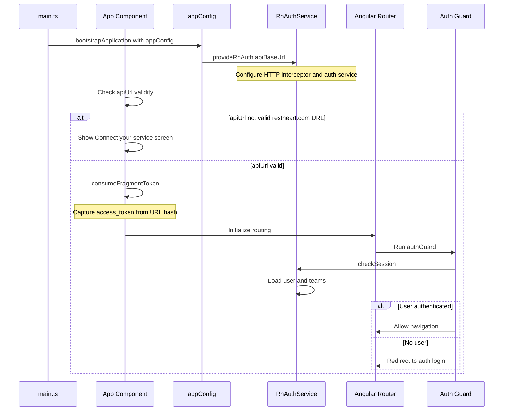
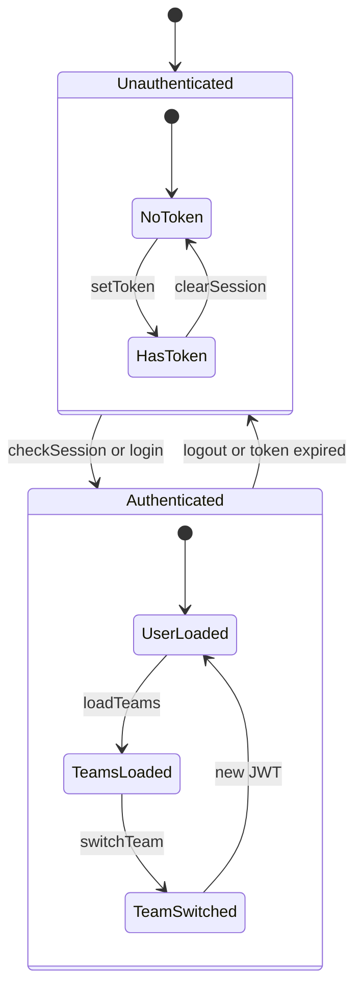
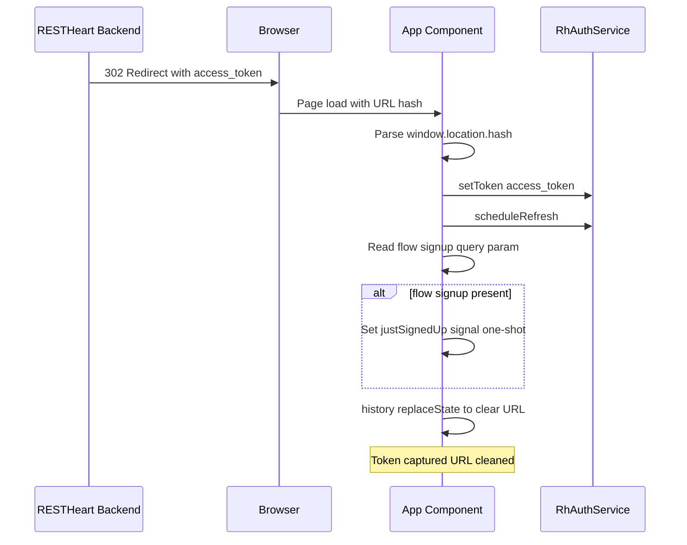
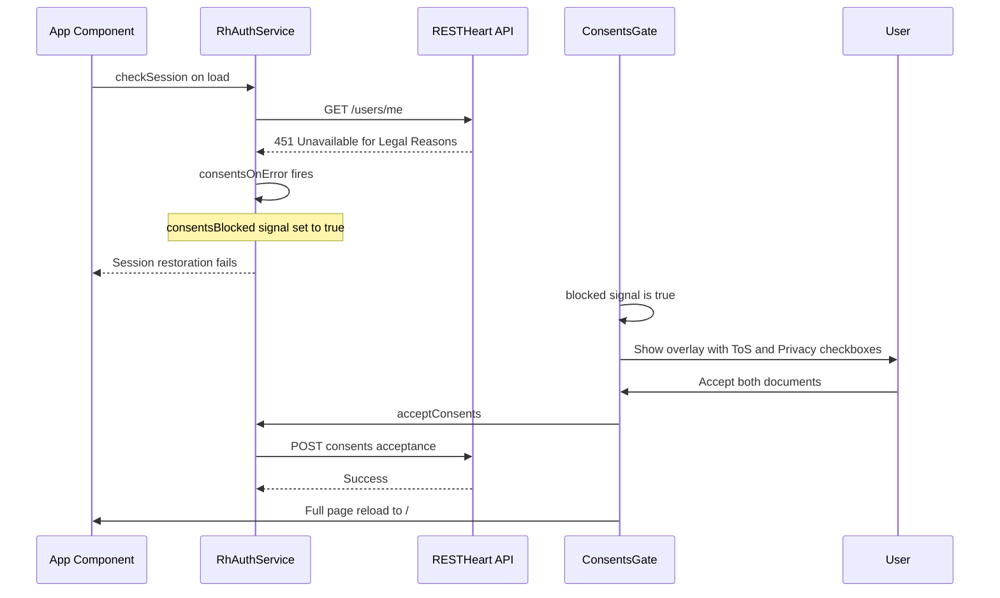

# Architecture Overview

## Layer model

The application has three distinct layers:

```
┌─────────────────────────────────────────────┐
│  Templates (HTML + page CSS)                │  ← Disposable skin layer
├─────────────────────────────────────────────┤
│  Component classes (Angular signals/forms)   │  ← Glue — framework-specific
├─────────────────────────────────────────────┤
│  @restheart-cloud/kit (plain TypeScript)     │  ← Portable — do not reimplement
└─────────────────────────────────────────────┘
```

- **Templates** — semantic HTML with class hooks (`.card`, `.btn-primary`, `.form-field`). The default CSS skin in `src/styles.css` is deliberately disposable; see [Operations](operations.md#css-theming) for restyling.
- **Components** — Angular signal-based state, reactive forms, `RhAuthService` injection. Framework-specific glue.
- **`@restheart-cloud/kit`** — plain TypeScript with a Promise-based API. Handles all HTTP calls, token storage, and session logic. **Do not reimplement auth logic, HTTP calls, or token handling** — depend on kit directly.

The `@restheart-cloud/kit-ng` package bridges kit and Angular: it provides `RhAuthService` (reactive state), `authGuard`/`publicGuard`, and an HTTP interceptor that attaches the bearer token and clears the session on 401/expiry.

## SSR / CSR split



The app uses Angular 21's hybrid SSR model. Routes declare their render mode in `src/app/app.routes.server.ts`:

| Render mode | Routes | Why |
|---|---|---|
| `Prerender` | `/auth/login`, `/auth/signup`, `/auth/forgot-password`, `/auth/reset-password` | Static HTML — no live data needed |
| `Client` | `/auth/verify`, `/invitations/accept`, all authenticated routes (`/home`, `/teams/*`, `/account`) | Require live API calls or in-memory token |

The SSR entry point is `src/server.ts` — an Express 5 app that serves static files from `/browser` and delegates all other requests to `AngularNodeAppEngine`. The server listens on `PORT` or defaults to 4000.

The server bootstrap is `src/main.server.ts`, which calls `bootstrapApplication(App, config, context)` using a merged config (`src/app/app.config.server.ts`) that layers `provideServerRendering(withRoutes(serverRoutes))` on top of the client `appConfig`.

**Key constraint:** authenticated routes cannot be server-rendered because the bearer token lives in an in-memory signal, not in a cookie. SSR renders the public auth pages; CSR takes over once the user is authenticated.

**Change navigation:** When modifying SSR/CSR behavior, check `src/app/app.routes.server.ts` for render mode assignments and `src/server.ts` for the Express server configuration. Test with `ng build && node dist/restheart-cloud-starter-ng/server/server.mjs` and verify auth pages are prerendered (view source shows HTML) while authenticated routes are client-rendered only.

## Bootstrap flow



1. `src/main.ts` bootstraps `App` with `appConfig`
2. `appConfig` calls `provideRhAuth({ apiBaseUrl, onError: consentsOnError })` — this configures the HTTP interceptor, auth service, and the consents error handler
3. If `apiUrl` is not a valid `*.restheart.com` URL, no routes are provided — the app shows the "Connect your service" screen
4. On browser load, `App` calls `consumeFragmentToken()` to capture any `#access_token=...` from the URL (returned by email verification or OAuth redirects)
5. Route guards run: `authGuard` calls `checkSession()` (which also loads teams), `publicGuard` redirects signed-in users away from auth pages

**Change navigation:** When modifying the bootstrap flow, start with `src/app/app.ts` for fragment token handling, then `src/app/app.config.ts` for provider configuration. Test with `ng serve` and verify the "Connect your service" screen appears for invalid URLs. For auth guard changes, check `src/app/app.routes.ts` and test with `ng test`.

## Routing and guards

Defined in `src/app/app.routes.ts`. Two guards from `@restheart-cloud/kit-ng`:

- **`authGuard`** — runs `checkSession()`; if no user, redirects to `/auth/login`. Also loads teams as a side effect.
- **`publicGuard`** — inverse: if user exists, redirects into the app.

`/invitations/accept` is deliberately **unguarded** — it must work for signed-out invitees, signed-in users, and people without an account.

Routes are conditionally included based on feature flags from `environment.features`. A flag that's off removes the route entirely. The flags are `emailRegistration`, `passwordReset`, `oauthLogin`, and `teamInvitations`; they must match the corresponding toggles on the RESTHeart Cloud service.

Per-route titles use a custom `AppTitleStrategy` that appends `· RESTHeart Cloud Starter` to every title. See [Domain Concepts](domain-concepts.md#feature-flags) for the flag model.

## Auth state model



`RhAuthService` exposes reactive signals:

| Signal | Type | Notes |
|---|---|---|
| `user()` | `UserInfo \| null` | `user._id` is the email. Profile at `user.profile.name`/`.surname` |
| `teams()` | `TeamMembership[]` | Each has `id.$oid`, `name`, `description`, `role`, `active` |
| `isAuthenticated()` | `boolean` | Derived from `user` |

**Key methods:**
- `auth.api(endpoint)` — authenticated `fetch` wrapper that attaches the bearer token. Returns `Observable<Response>`. Use for custom API calls to your RESTHeart Cloud service.
- `checkSession()` — loads user and teams. Short-circuits to `null` with empty teams when there's no stored token.
- `login(email, password)` — authenticates and loads teams in the same round trip.
- `loadTeams()` — explicitly refreshes teams and updates the `teams()` signal.
- `switchTeam(teamId)` — reissues the JWT with a new active team — no page reload needed.
- `acceptConsents()` — records the user's acceptance of Terms of Service and Privacy Policy. Used by the consents gate.

**Critical behavior:**
- `checkSession()` also loads teams. It short-circuits to `null` with empty teams when there's no stored token (no HTTP call), otherwise fetches user then teams.
- `login()` also loads teams in the same round trip.
- `loadTeams()` explicitly refreshes teams and updates the `teams()` signal. Returns an Observable that emits the teams array. Used by `Teams` and `TeamDetail` components for manual refresh (e.g., after team deletion).
- `switchTeam()` reissues the JWT with a new active team — no page reload needed.

Get these wrong and team-dependent UI is intermittently empty.

**Change navigation:** When modifying auth state behavior, start with `@restheart-cloud/kit-ng` package for `RhAuthService` implementation. Test with `ng test` and verify team-dependent UI works correctly. For token lifecycle changes, check `src/app/app.ts` for fragment token handling and test with manual flows from TEST-CASES.md.

## Fragment token capture



After email verification and after OAuth, the backend 302-redirects with the token in the URL fragment:

```
https://your-app/#access_token=…&token_type=Bearer&expires_in=900
```

`consumeFragmentToken()` in `src/app/app.ts`:
1. Reads `#access_token=...` from the hash → calls `setToken()` + `scheduleRefresh()`
2. Reads `?flow=signup` query param → sets the `justSignedUp` signal (one-shot, for welcome banner)
3. Clears both from the URL bar via `history.replaceState()`

This runs once on browser load, before route guards execute.

**Change navigation:** When modifying fragment token handling, edit `src/app/app.ts` and test with email verification and OAuth flows. Verify the welcome banner appears only for fresh signups (not subsequent logins) and that the URL is cleaned properly. Use browser DevTools Network tab to check for extra `POST /token` calls.

## Token lifecycle

- Bearer token has a **15-minute TTL**
- `scheduleRefresh()` from kit silently renews at ~80% (~12 minutes)
- The HTTP interceptor attaches the token to all API calls
- On 401/expiry, the interceptor clears the session

## Consents gate



A server-side Guards rule blocks every API request from a user who has not accepted the current Terms of Service and Privacy Policy, returning HTTP `451 Unavailable for Legal Reasons`. Because `/users/me` is among the blocked requests, the very first thing the app does on load — restoring the session — is what trips the gate.

The mechanism has three parts:

1. **`src/app/consents.ts`** — a plain module (not a service, because `onError` is handed to `provideRhAuth` before the injector is built) that exports a `consentsBlocked` signal and a `consentsOnError` function. The function sets the signal to `true` on any `451` status from the API.

2. **`src/app/consents-gate.ts`** — a component placed in `app.html` **outside and before** `<router-outlet>`. This placement is critical: a blocked user has no session, so `authGuard` fails and navigation is cancelled — nothing inside the outlet ever renders. The gate shows a modal overlay with two checkboxes (Terms of Service and Privacy Policy), an "I accept" button, and a "Sign out" button. On acceptance it calls `auth.acceptConsents()` and does a full page reload (`window.location.assign('/')`) rather than a router navigation, because the guard already cancelled the original navigation and re-entering with a fresh token is simpler than replaying a failed one.

3. **`src/app/app.config.ts`** — wires `consentsOnError` into `provideRhAuth({ onError: consentsOnError })`. The kit calls `onError` for every failure, including session restoration ones that no caller is waiting on — this is the only place that can distinguish "blocked by consents" from "simply signed out."

**Key invariants:**
- The overlay is user experience, not enforcement. Remove it with dev tools and every request still returns `451`. The rule lives on the server.
- The client does not know which document versions are current. The server's Guards rule decides what is being accepted; bumping versions requires no change and no redeploy on the client side.
- The `consentsBlocked` signal is a plain module-level signal, not persisted. A sign-out clears it so the next user on the same tab does not see the overlay before making a single request.
- The "Sign out" button clears the signal and calls `auth.logout()` before redirecting to `/auth/login`.

**Change navigation:** When modifying the consents gate, start with `src/app/consents.ts` for the error handler and signal, then `src/app/consents-gate.ts` for the overlay component. The template is `src/app/consents-gate.html`. Test by simulating a `451` response from the API and verifying the overlay appears, acceptance works, and sign-out clears the state.

## Page title strategy

`AppTitleStrategy` in `src/app/app.routes.ts` extends Angular's `TitleStrategy`. Each route declares a `title` property; the strategy prepends it with `· RESTHeart Cloud Starter`. If no title is set, just the suffix is used.

## Navigation progress

The `Shell` component subscribes to router events and sets a `navigating` signal between `NavigationStart` and `NavigationEnd`/`Cancel`/`Error`. This drives a thin progress bar at the top of the page during lazy route loading.

## Change navigation

When making changes to the architecture, follow this guidance:

### For routing and guard changes
- **Start with:** `src/app/app.routes.ts` for route definitions and guards
- **Check:** `src/app/app.routes.server.ts` for SSR render mode assignments
- **Test with:** `ng test` and manual testing of route navigation
- **Important symbols:** `authGuard`, `publicGuard`, `AppTitleStrategy`

### For SSR/CSR changes
- **Start with:** `src/app/app.routes.server.ts` for render mode assignments
- **Check:** `src/server.ts` for Express server configuration
- **Test with:** `ng build && node dist/restheart-cloud-starter-ng/server/server.mjs`
- **Validation:** Auth pages should be prerendered (view source shows HTML), authenticated routes client-rendered only

### For auth state changes
- **Start with:** `@restheart-cloud/kit-ng` package for `RhAuthService` implementation
- **Check:** `src/app/app.ts` for fragment token handling
- **Test with:** Manual flows from TEST-CASES.md
- **Important signals:** `user()`, `teams()`, `isAuthenticated()`

### For bootstrap changes
- **Start with:** `src/app/app.ts` for fragment token handling
- **Check:** `src/app/app.config.ts` for provider configuration
- **Test with:** `ng serve` and verify "Connect your service" screen appears for invalid URLs
- **Validation:** `ng build` succeeds, SSR server starts without errors

### For consents gate changes
- **Start with:** `src/app/consents.ts` for the error handler and signal
- **Check:** `src/app/consents-gate.ts` and `src/app/consents-gate.html` for the overlay
- **Test with:** Simulated `451` responses from the API
- **Validation:** Overlay appears on `451`, acceptance reloads the page, sign-out clears the blocked signal
