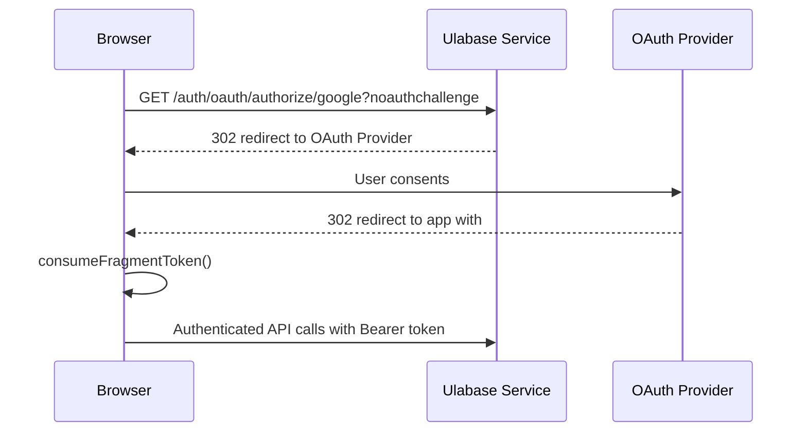
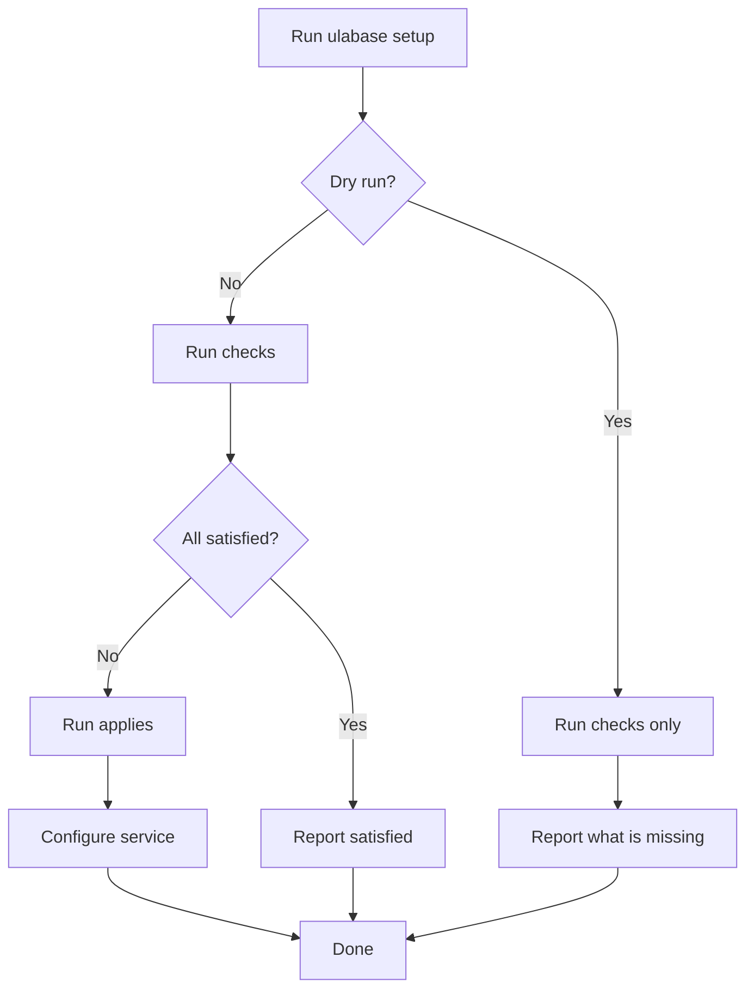

# Integrations & Dependencies

## @ulabase/kit

[`@ulabase/kit`](https://github.com/ulabase/kit/tree/main/packages/kit) is the core TypeScript library. It provides:

- **Auth functions:** `register`, `verify`, `login`, `logout`, `checkSession`, `forgotPassword`, `resetPassword`
- **Team functions:** `loadTeams`, `switchTeam`, `listTeamMembers`, `createTeam`, `updateTeam`, `deleteTeam`
- **Invitation functions:** `invite`, `resendInvite`, `getInvitation`, `activate`, `acceptInvite`, `listInvitations`
- **Member functions:** `removeMember`, `updateMemberRole`
- **Profile functions:** `updateProfile`, `changePassword`
- **Token management:** `setToken`, `getToken`, `scheduleRefresh`, `clearSession`

**Key properties:**
- Plain TypeScript, Promise-based API, no framework coupling
- Handles all HTTP calls, token storage (localStorage), and session logic
- 100% portable across frameworks — React/Vue ports should depend on it directly

## @ulabase/kit-ng

[`@ulabase/kit-ng`](https://github.com/ulabase/kit/tree/main/packages/kit-ng) is the Angular adapter. It provides:

- **`RhAuthService`** — injectable service wrapping kit functions as Observables. Exposes reactive signals: `user()`, `teams()`, `isAuthenticated()`.
- **`authGuard`** / **`publicGuard`** — route guards that call `checkSession()`
- **HTTP interceptor** — attaches bearer token to all API calls, clears session on 401/expiry
- **`provideRhAuth({ apiBaseUrl, onError? })`** — Angular provider function configured in `app.config.ts`
- **`isValidApiBaseUrl(url)`** — validates that a URL points to a Ulabase service; used to guard route registration and show a configuration screen when unset
- **`setToken`**, **`scheduleRefresh`** — standalone functions for manual token management (used for fragment token capture after OAuth/email verification redirects)
- **`acceptConsents()`** — method on `RhAuthService` for the consents gate pattern

**Configuration** in [`src/app/app.config.ts`](../src/app/app.config.ts):

```typescript
provideRhAuth({ apiBaseUrl: environment.apiUrl, onError: consentsOnError })
```

The `onError` callback receives every failure the kit encounters, including session restoration errors that no caller is waiting on. The starter uses this to detect `451` responses from the consents gate (see [`src/app/consents.ts`](../src/app/consents.ts)).

**Version:** currently `^0.12.0` (see [`package.json`](../package.json)).

**`auth.api()` method:** provides an authenticated `fetch` wrapper that attaches the bearer token and handles errors. Returns an `Observable<Response>`. Use it for custom API calls to your Ulabase service:

```typescript
this.auth.api('/demo').pipe(
  switchMap(res => res.json()),
  map(json => Array.isArray(json) ? json : []),
).subscribe(data => this.items.set(data));
```

**Key features of `auth.api()`:**
- Automatically attaches the bearer token to the request
- Handles authentication errors (401/expiry) by clearing the session
- Returns an `Observable<Response>` for reactive programming
- Simpler than using `HttpClient` directly for authenticated calls
- The home page includes a working demo of this pattern (see [`src/app/pages/home/home.ts`](../src/app/pages/home/home.ts))

**When to use `auth.api()` vs `HttpClient`:**
- Use `auth.api()` for simple authenticated calls to your Ulabase service
- Use `HttpClient` when you need more control over headers, interceptors, or request configuration
- Both approaches work — `auth.api()` is recommended for most cases

## Ulabase service

The starter is a frontend for [Ulabase](https://ulabase.com) services. Each service provides:

- **Auth endpoints** — `/auth/*` (register, verify, login, invite, etc.)
- **Token endpoint** — `/token` (login, renew)
- **User endpoint** — `/users/me` (session check)
- **Team endpoints** — `/auth/teams`, `/auth/team/*`, `/auth/team/members`

**Service tiers:**
- **Free** — for development only
- **Shared** (or higher) — for production

**API base URL format:** `https://<id>.ulabase.app`

## OAuth providers

OAuth is configured server-side in your Ulabase service. The starter supports:

- **Google** — `oauthUrl('google')` → `{apiUrl}/auth/oauth/authorize/google?noauthchallenge`
- **GitHub** — `oauthUrl('github')` → `{apiUrl}/auth/oauth/authorize/github?noauthchallenge`

The `oauthProviders` array in `environment.features` must match what's configured server-side. The `OauthButtons` component renders a button per provider.

**OAuth flow:** browser redirect → provider consent → backend redirect with `#access_token=...` → fragment token capture in `App` via `consumeFragmentToken()` (see [`src/app/app.ts`](../src/app/app.ts)).



The `noauthchallenge` query parameter tells the Ulabase service not to challenge for credentials before redirecting to the OAuth provider.

## @ulabase/cli

[`@ulabase/cli`](https://github.com/ulabase/kit/tree/main/packages/cli) is a dev dependency (`^0.12.0`) that provisions a Ulabase service to match what the starter expects.

**Workflow:**

```bash
npm i -D @ulabase/cli
ulabase login
ulabase setup --srv <srvId> --dry-run    # what is missing
ulabase setup --srv <srvId>              # make it so
```

**Setup file pattern:** The starter ships two setup files:

- [`ulabase.setup.ts`](../ulabase.setup.ts) — configures the accounts plugin: feature flags, OAuth credentials, CORS origin allowlist. Imports `environment.dev.ts` so feature flags are stated once — the same values drive both the app and the server configuration.
- [`ulabase.setup.consents.ts`](../ulabase.setup.consents.ts) — extends the accounts setup with the consents gate (user schema, guard rule, permission). Run with `--file ulabase.setup.consents.ts`.

Each setup file exports a `defineSetup(...)` call containing an array of `step(...)` objects. Each step has a `check` (is the service already in the desired state?) and an `apply` (make it so). Running against an already-configured service writes nothing; `--dry-run` runs the checks only.

**Key imports from `@ulabase/cli`:**
- `defineSetup`, `step` — setup file DSL
- `fromEnv` — resolves a secret from environment variables at apply time
- `isRedacted` — detects whether a stored secret reads back as bullets
- `isApiError` — type guard for API error responses (used to treat `409 Plugin already installed` as success)
- `AdminClient`, `PluginConfig` — types for the admin API

**What the setup configures:**
1. Accounts plugin installation and feature flag alignment
2. OAuth provider credentials (Google, GitHub) — only when the app's feature flags say so
3. CORS origin allowlist — ensures the app origin may call the service
4. (With `ulabase.setup.consents.ts`) User document schema, guard rule, and consents permission



## OpenWiki CI

The repository has an OpenWiki GitHub Actions workflow at [`.github/workflows/openwiki-update.yml`](../.github/workflows/openwiki-update.yml):

- **Schedule:** cron `0 3 * * *` (nightly at 03:00 UTC), push of version tags (`[0-9]+.[0-9]+.[0-9]+`), and manual `workflow_dispatch`
- **Change detection:** on scheduled runs the workflow compares the repo since the last `openwiki/` commit and skips the run when nothing changed, avoiding unnecessary API cost; release-tag and manual runs always proceed
- **Action:** runs `openwiki code --update --print` (or `--init` on the first run when no wiki exists), creates a PR with documentation updates
- **Model:** `xiaomi/mimo-v2.5-pro` via OpenRouter
- **Tracing:** disabled

The workflow commits to branch `openwiki/update` and creates a PR via `peter-evans/create-pull-request`. It updates paths under `openwiki/`, `AGENTS.md`, and `CLAUDE.md`. The PR is auto-merged (squash, delete branch) so the wiki stays current without manual intervention.

## Angular ecosystem

| Package | Version | Role |
|---|---|---|
| `@angular/core` | ^21.2.0 | Framework |
| `@angular/ssr` | ^21.2.7 | Server-side rendering |
| `@angular/router` | ^21.2.0 | Client-side routing |
| `@angular/forms` | ^21.2.0 | Reactive forms |
| `@angular/platform-server` | ^21.2.0 | Server platform |
| `express` | ^5.1.0 | SSR server |
| `rxjs` | ~7.8.0 | Reactive extensions |
| `typescript` | ~5.9.2 | Language |

## Dev dependencies

| Package | Version | Role |
|---|---|---|
| `@angular/build` | ^21.2.7 | Build system |
| `@angular/cli` | ^21.2.7 | CLI tools |
| `@ulabase/cli` | ^0.12.0 | Service provisioning (`ulabase setup`) |
| `vitest` | ^4.0.8 | Test runner |
| `jsdom` | ^28.0.0 | DOM implementation for tests |
| `prettier` | ^3.8.1 | Code formatting |

## Adding new API endpoints

When Ulabase adds new endpoints:

1. **Kit** — add a wrapper function in `@ulabase/kit`
2. **Kit-ng** — add a method to `RhAuthService` in `@ulabase/kit-ng`
3. **Starter** — wire the new method into the appropriate component

See [`specs/done/account-team-management.md`](../specs/done/account-team-management.md) for an example of this process (9 new endpoints added for RESTHeart 9.6.0, now part of the Ulabase service).

## Change navigation for integrations

### For @ulabase/kit changes
- **Start with:** `@ulabase/kit` package for TypeScript auth logic
- **Check:** `@ulabase/kit-ng` for Angular adapter updates
- **Test with:** Manual API testing and `ng test`
- **Validation:** New functions follow Promise-based API pattern

### For @ulabase/kit-ng changes
- **Start with:** `@ulabase/kit-ng` package for Angular adapter
- **Check:** `src/app/app.config.ts` for provider configuration
- **Test with:** `ng test` and manual flows from TEST-CASES.md
- **Validation:** `RhAuthService` exposes new methods as Observables

### For OAuth provider changes
- **Start with:** `src/app/pages/auth/oauth-buttons/oauth-buttons.ts` for button rendering
- **Check:** `src/app/oauth-url.ts` for URL construction
- **Test with:** Manual OAuth flows from TEST-CASES.md
- **Validation:** OAuth buttons appear only when `oauthLogin` flag is enabled

### For ulabase CLI / setup file changes
- **Start with:** `ulabase.setup.ts` for accounts configuration
- **Check:** `ulabase.setup.consents.ts` for consents gate extension
- **Test with:** `ulabase setup --srv <srvId> --dry-run` to verify checks
- **Validation:** `--dry-run` reports all steps satisfied on a configured service

### For CI/CD changes
- **Start with:** `.github/workflows/openwiki-update.yml` for OpenWiki workflow
- **Check:** Workflow schedule (cron, tag push, manual dispatch) and model configuration
- **Test with:** Manual workflow dispatch or push a version tag
- **Validation:** PR is created with documentation updates
