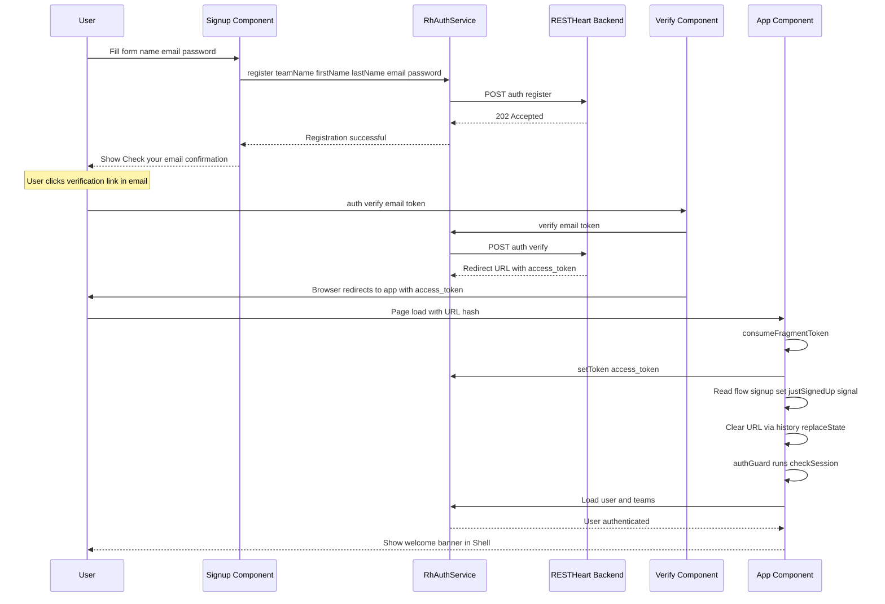
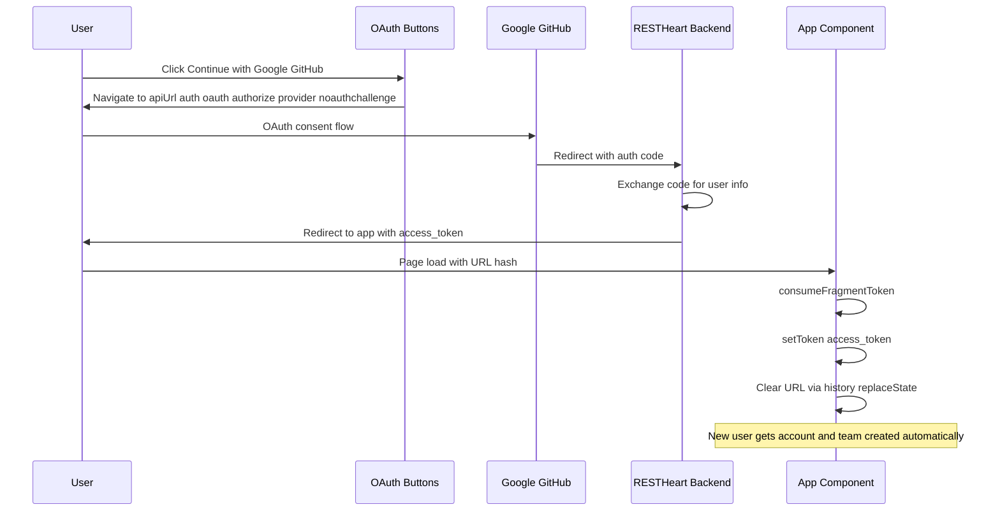
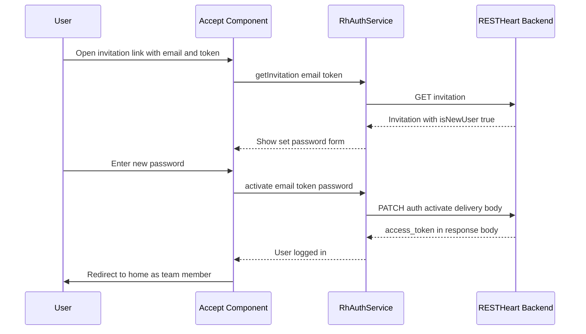
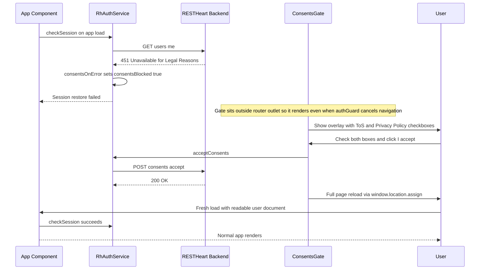

# Key User Workflows

## Signup & email verification



**Entry:** `/auth/signup` (gated by `emailRegistration` or `oauthLogin` flag)

1. User fills first name, last name, email, password (min 8 chars)
2. Component calls `auth.register({ teamName, firstName, lastName, email, password })`
3. Team name is auto-generated as `"{firstName}'s Team"` — no UI field
4. On success: shows "Check your email" confirmation. User is **not** logged in yet.
5. User clicks verification link → backend redirects to `/auth/verify?email=...&token=...`
6. [`Verify`](../src/app/pages/auth/verify/verify.ts) component calls `auth.verify(email, token)` which returns a redirect URL
7. Browser navigates to the redirect URL with `#access_token=...` in the fragment
8. [`App`](../src/app/app.ts) consumes the fragment token via `consumeFragmentToken()`, also reads `?flow=signup` to set `justSignedUp` signal
9. `authGuard` runs `checkSession()`, user is authenticated, welcome banner appears in Shell

**Key detail:** the `?flow=signup` marker is a one-shot signal. It's set only on the redirect after a fresh signup (email verification or OAuth), consumed once by `App`, and never persisted. The welcome banner copy must not claim "email verified" because OAuth signups also trigger it.

**Change navigation:** When modifying signup flow, edit `src/app/pages/auth/signup/signup.ts` for the registration form and `src/app/pages/auth/verify/verify.ts` for email verification. Test with `ng test` and manual flows from TEST-CASES.md. Verify the welcome banner appears only for fresh signups.

## Login / logout

**Entry:** `/auth/login` (always available)

1. User enters email + password
2. Component calls `auth.login(email, password)` — this also loads teams in the same round trip
3. On success: `router.navigateByUrl('/')` → redirected to home
4. On 401: shows "Invalid email or password."
5. Logout: `auth.logout()` → redirects to `/auth/login`

**Session persistence:** after login, the token is stored in localStorage. A hard refresh preserves the session because `checkSession()` reads the stored token and fetches the user.

## OAuth (Google / GitHub)



**Entry:** OAuth buttons on login/signup pages (gated by `oauthLogin` flag)

1. User clicks "Continue with Google/GitHub"
2. Browser navigates to `{apiUrl}/auth/oauth/authorize/{provider}?noauthchallenge`
3. Provider consent flow happens on the provider's site
4. Backend redirects back to the app with `#access_token=...` in the fragment
5. Same fragment token capture as email verification
6. A new user via OAuth gets an account + team created automatically

**`noauthchallenge` query param:** appended to the OAuth URL to skip the auth challenge step — the backend handles the full flow.

**Change navigation:** When modifying OAuth flow, edit `src/app/pages/auth/oauth-buttons/oauth-buttons.ts` for button rendering and `src/app/oauth-url.ts` for URL construction. Test with `ng test` and manual flows from TEST-CASES.md. Verify OAuth buttons appear only when `oauthLogin` flag is enabled.

## Forgot / reset password

**Entry:** `/auth/forgot-password` (gated by `passwordReset` flag)

1. User enters email
2. Component calls `auth.forgotPassword(email)`
3. API always returns 202 regardless of whether the email exists (prevents email enumeration)
4. Shows same confirmation either way: "If an account exists for that address, we sent a link"
5. User clicks reset link → arrives at `/auth/reset-password?email=...&token=...`
6. User enters new password (min 8 chars)
7. Component calls `auth.resetPassword({ email, token, password })`
8. `PATCH /auth/reset-password?delivery=body` returns `access_token` directly in the response body — no follow-up `POST /token` (this is bearer-mode delivery; same pattern used by `activate` and `switch-team`)
9. User is logged in automatically, redirected to home

## Team invitations — new user



**Entry:** `/invitations/accept?email=...&token=...` (gated by `teamInvitations` flag)

1. [`Accept`](../src/app/pages/invitations/accept/accept.ts) component calls `auth.getInvitation(email, token)` on init
2. If `invitation.isNewUser === true`: shows "Set password" form
3. User sets password → calls `auth.activate({ email, token, password })`
4. `PATCH /auth/activate?delivery=body` returns `access_token` directly
5. User is logged in and team member, redirected to home

## Team invitations — existing user

1. Same invitation link, but `isNewUser === false`
2. **If already logged in:** shows "Join {teamName}" with a single button → calls `auth.acceptInvite(token)`
3. **If not logged in:** shows login form → `auth.login()` then `auth.acceptInvite(token)`
4. New team appears in the team switcher

## Team switching

1. User sees team list at `/teams`
2. Active team has a "current" badge; clicking a non-active team row switches to it and navigates to the detail page
3. `auth.switchTeam(team.id)` → `POST /auth/switch-team?delivery=body` returns new token
4. Session updates immediately with the new active team — no page reload
5. While switching, a "Switching…" indicator replaces the team row actions

**Note:** the team switcher in the Shell header is only visible when `auth.teams().length > 1`.

## Team management

**Entry:** `/teams/:id` (owner-only sections gated by `isOwner()`)

### Members
- Owner sees full member list with role dropdowns and remove buttons
- Role change: `auth.updateMemberRole(email, role)` — optimistically updates the local list
- Remove: confirmation step ("Remove? Yes/No") → `auth.removeMember(email)` — owners can't remove themselves

### Invitations
- Owner sees invite form (email + role) and pending invitations list
- Invite: `auth.invite(email, role)` — 409 shows "already a member"
- Resend: `auth.resendInvite(email)` — 5-minute cooldown with reactive countdown timer
- Cooldown uses a ticking `now` signal updated every 30s so the countdown label stays accurate in zoneless Angular

### Team settings
- Name and description form → `auth.updateTeam({ name, description })`
- Danger zone: delete team → confirmation dialog (`role="alertdialog"`) → `auth.deleteTeam()`
- Delete only works when no other members remain (backend enforces with 409)
- After successful deletion, the component reloads the team list. If remaining teams exist but none is active, it auto-switches to the first remaining team before navigating to `/teams`

## Account management

**Entry:** `/account`

### Profile
- Loads current profile via `auth.checkSession()` on init
- Form fields: first name, last name (email is read-only)
- `auth.updateProfile({ firstName, lastName })` → writes to `profile.name`/`profile.surname`

### Change password
- `currentPassword` is intentionally **not required** at the form level — OAuth users may never have set one
- Backend verifies current password only when the account actually has one
- `auth.changePassword(currentPassword, newPassword)`
- Hint shown for OAuth users: "Leave blank if you've never set a password"

## Consents gate



**Trigger:** A server-side Guards rule blocks every request from a user who has not accepted the current Terms of Service and Privacy Policy, responding with HTTP 451. Because `/users/me` is one of those requests, session restoration is the first thing that trips the gate.

**Entry:** automatic on session restore — no route or manual action required.

1. `provideRhAuth` is configured with `onError: consentsOnError` in `app.config.ts`
2. When any API call returns 451, `consentsOnError` sets the `consentsBlocked` signal to `true`
3. [`ConsentsGate`](../src/app/consents-gate.ts) component sits in `app.html` **outside** the `<router-outlet>` — this placement is critical because `authGuard` cancels navigation when session restore fails, so nothing inside the outlet renders
4. The overlay shows two checkboxes (Terms of Service, Privacy Policy) and an "I accept" button disabled until both are checked
5. On accept: calls `auth.acceptConsents()` — the request carries no versions; the server's permission `mergeRequest` stamps both document versions and the timestamp
6. On success: `window.location.assign('/')` triggers a full page reload rather than router navigation, because the guard already cancelled the original navigation
7. On the fresh load the user document is readable, `authGuard` passes, and the normal app renders
8. Alternative: "Sign out" button clears `consentsBlocked`, calls `auth.logout()`, and redirects to `/auth/login`

**Key invariant:** the overlay is user experience, not enforcement. Removing it with dev tools changes nothing — every request still returns 451. The rule lives on the server. Bumping document versions in the Guards rule requires no client change or redeploy.

**Change navigation:** When modifying the consents gate, edit `src/app/consents-gate.ts` for logic, `src/app/consents-gate.html` for the overlay template, and `src/app/consents.ts` for the signal and error handler. The `consentsOnError` function is registered in `src/app/app.config.ts` via `provideRhAuth`.

## Home page demo fetch

**Entry:** `/home` (authenticated)

The home page includes a "Fetch your data" section that demonstrates how to use `auth.api()` for authenticated API calls:

1. User clicks "Fetch /demo" button
2. Component calls `auth.api('/demo')` — an authenticated `fetch` wrapper that attaches the bearer token
3. Response is parsed as JSON and displayed in a code block
4. Errors are caught and displayed with appropriate messaging

**Key implementation details:**
- Uses `auth.api()` instead of `HttpClient` — simpler syntax, automatic token attachment
- Handles loading state with `demoLoading` signal
- Catches and displays errors with `demoError` signal
- Shows parsed JSON data with `demoData` signal

**To use this pattern in your own components:**
```typescript
import { RhAuthService } from '@restheart-cloud/kit-ng';

private readonly auth = inject(RhAuthService);

fetchData() {
  this.auth.api('/your-endpoint').pipe(
    switchMap(res => res.json()),
  ).subscribe(data => this.items.set(data));
}
```

**Change navigation:** When modifying the home page demo, edit `src/app/pages/home/home.ts` for the fetch logic and `src/app/pages/home/home.html` for the template. Test with `ng serve` and verify the demo button works when connected to a RESTHeart Cloud service with a `/demo` collection.

## Change navigation for workflows

### Auth flow changes
- **Start with:** `src/app/pages/auth/` for component implementations
- **Check:** `src/app/pages/auth/oauth-buttons/` for OAuth button rendering
- **Test with:** Manual flows from TEST-CASES.md
- **Important files:** `login.ts`, `signup.ts`, `verify.ts`, `forgot-password.ts`, `reset-password.ts`

### Team management changes
- **Start with:** `src/app/pages/teams/` for team list and detail components
- **Check:** `src/app/pages/invitations/accept/` for invitation acceptance flow
- **Test with:** Manual flows from TEST-CASES.md
- **Important files:** `teams.ts`, `team-detail.ts`, `accept.ts`

### Account management changes
- **Start with:** `src/app/pages/account/account.ts` for profile and password changes
- **Check:** `src/app/app.ts` for fragment token handling (affects account creation)
- **Test with:** Manual flows from TEST-CASES.md
- **Validation:** Verify OAuth users can change password without current password

### Consents gate changes
- **Start with:** `src/app/consents-gate.ts` for overlay logic and `src/app/consents.ts` for the signal and error handler
- **Check:** `src/app/app.config.ts` where `consentsOnError` is registered with `provideRhAuth`
- **Test with:** Manual flows — trigger a 451 from the backend and verify the overlay appears, accept works, and sign-out clears the flag
